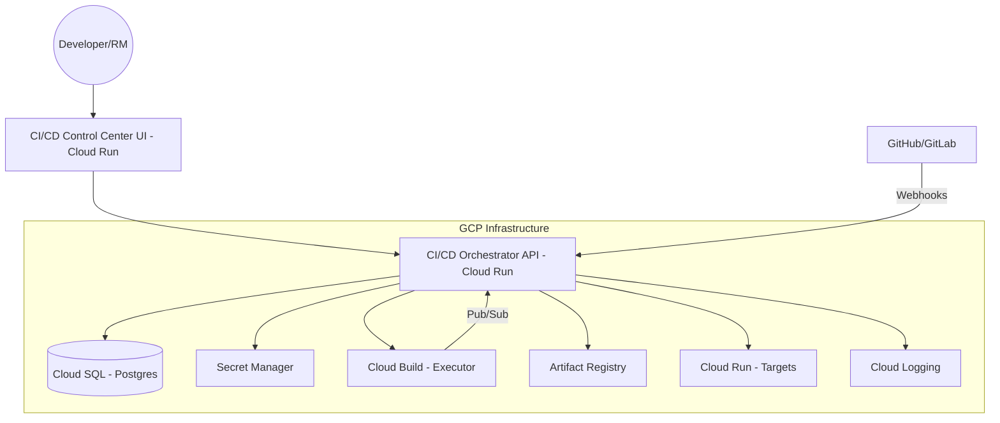

# CI/CD Control Center: System Design & Architecture

## 1. Executive Summary
The CI/CD Control Center is a production-grade, Jenkins-inspired orchestration platform running on Google Cloud Run. It serves as the single pane of glass for visual pipeline monitoring, controlled deployments with approval gates, RBAC, and DORA metrics tracking.

## 2. Target Architecture

### Components
- **UI (React/Vite)**: Modern dashboard for pipeline visualization, logs streaming (from Cloud Logging), and deployment controls.
- **Orchestrator API (FastAPI)**: Manages triggers, state, RBAC, and interacts with GCP SDKs for Cloud Build and Cloud Run.
- **Cloud Build**: The primary execution engine. It handles lints, tests, builds, and pushes images.
- **Cloud SQL**: Stores pipeline definitions, run history, approval records, and audit logs.
- **Cloud Logging**: Source of truth for raw build and deployment logs.
- **Secret Manager**: Secure reference for API keys, Git tokens, and deployment credentials.

## 3. Data Model

### Entity: Pipeline
- `id`: UUID
- `name`: string (e.g., "inka-api")
- `repo_url`: string
- `config_path`: string (path to `pipeline.yaml`)
- `status`: enum (ACTIVE, PAUSED)
- `tenant_id`: UUID (optional)

### Entity: PipelineRun
- `id`: UUID
- `pipeline_id`: UUID
- `trigger_type`: enum (WEBHOOK, MANUAL, SCHEDULED)
- `commit_sha`: string
- `status`: enum (QUEUED, RUNNING, SUCCESS, FAILURE, ABORTED)
- `build_id`: string (Cloud Build ID)
- `started_at`: timestamp
- `finished_at`: timestamp
- `triggered_by`: UUID (User ID)

### Entity: Deployment
- `id`: UUID
- `run_id`: UUID
- `environment`: enum (DEV, STAGING, PROD)
- `image_sha`: string (Build-once-promote)
- `status`: enum (PENDING_APPROVAL, DEPLOYING, SUCCESS, FAILED, ROLLED_BACK)
- `revision_id`: string (Cloud Run Revision)
- `traffic_split`: integer
- `approved_by`: UUID
- `approved_at`: timestamp

### Entity: AuditLog
- `id`: UUID
- `timestamp`: timestamp
- `user_id`: UUID
- `action`: string (e.g., "TRIGGER_BUILD", "APPROVE_PROD", "ROLLBACK")
- `resource_id`: UUID
- `metadata`: JSONB

## 4. API Contract (Selected Endpoints)

| Method | Endpoint | Description |
| :--- | :--- | :--- |
| `POST` | `/api/v1/pipelines/:id/run` | Manually trigger a pipeline run |
| `GET` | `/api/v1/runs` | List all recent pipeline runs |
| `GET` | `/api/v1/runs/:id` | Get status, stages, and metadata for a run |
| `GET` | `/api/v1/runs/:id/logs` | Stream/fetch logs from Cloud Logging |
| `POST` | `/api/v1/deployments/:id/approve` | Approve a pending deployment (RBAC restricted) |
| `POST` | `/api/v1/services/:name/rollback` | One-click rollback to previous revision |
| `GET` | `/api/v1/analytics/dora` | Fetch DORA metrics (Lead Time, MTTR, etc.) |

## 5. Security & Governance
- **RBAC**:
    - `SuperAdmin`: Full control over pipelines and IAM.
    - `ReleaseManager`: Can approve deployments to Prod.
    - `Developer`: Can trigger builds and deploy to Dev/Staging.
    - `Viewer`: Read-only access to dashboards and logs.
- **Build Once, Promote Many**: The same image SHA from the `build` stage is used for all subsequent environment promotions. No environment-specific builds.
- **Secrets**: No secrets in DB. API uses ADC (Application Default Credentials) to fetch references from Secret Manager at runtime.

## 6. Implementation Roadmap

### Phase 1: Core Orchestrator (Backend)
1. Initialize FastAPI project.
2. Setup Postgres schema with SQLAlchemy/Alembic.
3. Implement Cloud Build integration (triggering and status polling).
4. Implement basic RBAC.

### Phase 2: Visual Dashboard (Frontend)
1. Initialize React/Vite/MUI project.
2. Build Pipeline List and Run Details view.
3. Integrate Cloud Logging for real-time log viewing.

### Phase 3: Governance & Promotion
1. Implement Deployment Approval workflow.
2. Implement Cloud Run Revision management (Traffic split, Rollback).
3. Build Audit Logger.

### Phase 4: Observability & Metrics
1. Implement DORA metrics calculating logic.
2. Build Analytics dashboard.
3. Setup Slack/Telegram notifications.
