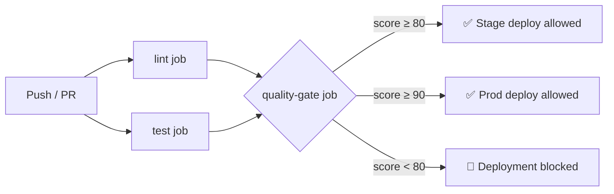

# Quality Score Agent — INKA Admin

> **Role:** Quality Score Agent | **System:** INKA Admin | **Purpose:** Evaluate release quality before deployment

---

## Section 1 — Scoring Algorithm

### Formula

```
raw_score  = Σ (dimension_weight × dimension_raw_score[0..100])
final_score = max(0, raw_score − Σ applied_penalties)
```

### Weighted Dimensions

| # | Dimension | Weight | What it measures |
|---|-----------|--------|-----------------|
| 1 | **Test Coverage** | 20% | `coverage_pct` via pytest-cov XML |
| 2 | **Defect Status** | 20% | Open S1/S2/S3 bugs from defect registry |
| 3 | **Security Scan** | 15% | Critical/High/Medium vulns (Trivy/Snyk/Bandit) |
| 4 | **Migration Risk** | 10% | Level 0–3 (NONE → HIGH) from release metadata |
| 5 | **Code Stability** | 10% | Code churn % vs previous release (git diff) |
| 6 | **Performance** | 10% | p95 latency vs 500ms SLA + error rate % |
| 7 | **Compliance** | 15% | Score fed from Compliance Agent (0–100) |

### Dimension Scoring Functions

| Dimension | Scoring Logic |
|-----------|--------------|
| Test Coverage | Linear: `max(0, (pct-50)*2)` → 0 pts at 50%, 100 pts at 100% |
| Defect Status | S1 → 0; S2 costs -25 pts each; S3 costs -5 pts each |
| Security Scan | Crit -30, High -15, Medium -5 per vuln, floored at 0 |
| Migration Risk | NONE=100, LOW=80, MEDIUM=50, HIGH=10 |
| Code Stability | 100 at ≤15% churn, linear decay to 0 at 60% churn |
| Performance | Avg of latency score (50% penalty at p95=500ms) + error rate score |
| Compliance | Direct pass-through from Compliance Agent |

---

## Section 2 — Penalty Matrix

Penalties are **subtracted from the raw weighted score** after dimension computation.

| Trigger | Penalty | Rule |
|---------|---------|------|
| Any open **S1** bug | **Score = 0** (hard zero) | Non-negotiable blocker |
| **CI tests failed** | **Score = 0** (hard zero) | Non-negotiable blocker |
| Open **S2** bug | **-30 pts** per bug, **cap -60** | Cumulative, capped |
| Coverage `< 80%` | **-20 pts** | One-time |
| **Critical** vuln | **-25 pts** per vuln, **cap -50** | Cumulative, capped |
| **High** vuln | **-10 pts** per vuln, **cap -20** | Cumulative, capped |
| No regression test for bug fix | **-15 pts** | One-time |
| Code churn `> 30%` | **-10 pts** | One-time |
| CI lint failed | **-10 pts** | One-time |

> [!CAUTION]
> **Hard zero rules:** Open S1 bug OR CI test failure immediately sets `final_score = 0`, bypassing all other calculation.

---

## Section 3 — Version Quality Report

### Report Schema

```python
@dataclass
class QualityReport:
    version: str
    git_sha: str
    evaluated_at: str       # UTC timestamp

    # Reflected inputs
    coverage_pct: float
    open_bugs: int          # S1 count
    open_s2: int
    critical_vulns: int
    high_vulns: int
    migration_risk: str     # "NONE" | "LOW" | "MEDIUM" | "HIGH"
    code_churn_pct: float
    p95_latency_ms: float
    compliance_score: float

    # Scoring
    dimension_scores: dict[str, float]   # weighted contribution per dim
    penalties: list[dict[str, Any]]      # [{reason, pts}, ...]
    raw_score: float
    final_score: float                   # 0–100

    recommendation: "PROD_READY" | "STAGE_ONLY" | "BLOCK"
```

### Recommendation Thresholds

| Score Range | Recommendation | Allowed Targets |
|-------------|---------------|-----------------|
| ≥ 90 | ✅ **PROD_READY** | Staging + Production |
| 80–89 | ⚠️ **STAGE_ONLY** | Staging only |
| < 80 | 🚫 **BLOCK** | Deployment blocked |

### Example Report (v1.3.0)

```
═══════════════════════════════════════════════════════
  INKA Quality Gate Report
═══════════════════════════════════════════════════════
  Version      : 1.3.0
  Git SHA      : a1b2c3d4e5f6
  Target       : PROD
  Gate         : 90 pts required
  Final Score  : 83.5 pts
  Recommendation: ⚠️  STAGE_ONLY
───────────────────────────────────────────────────────
  Dimension Scores:
    test_coverage        :  17.0 pts  (85.0% coverage)
    defect_status        :  20.0 pts  (0 S1, 0 S2)
    security_scan        :  12.0 pts  (1 high vuln)
    migration_risk       :  10.0 pts  (NONE)
    code_stability       :  10.0 pts  (10% churn)
    performance          :   9.5 pts  (p95=250ms)
    compliance           :  15.0 pts  (100/100)
───────────────────────────────────────────────────────
  Raw Score    : 93.5
  Penalties:
    ⛔ High vuln(s): 1: -10.0
  Final Score  : 83.5
═══════════════════════════════════════════════════════
```

---

## Section 4 — Telegram Commands

### `/release quality {version}`

Returns the quality report for a specific version tag.

**Input:** `/release quality 1.3.0`

**Output:**
```
📊 Quality Report — v1.3.0
Git SHA: `a1b2c3d4e5`

Score: [████████░░] 83.5/100

─────────────────────────
Dimension Breakdown
  Test Coverage      :  85.0%  → 17.0pts
  Defect Status      : 0S1 / 0S2 open  → 20.0pts
  Security Scan      : 0 crit / 1 high → 12.0pts
  Migration Risk     : NONE → 10.0pts
  Code Stability     : churn 10% → 10.0pts
  Performance        : p95=250ms → 9.5pts
  Compliance         : 100 → 15.0pts
─────────────────────────
Applied Penalties
  ⛔ High vuln(s): 1: -10

Recommendation: ⚠️ STAGE_ONLY

🕐 Evaluated: 2026-02-22 06:55 UTC
```

### `/release quality latest`

Same output but resolves the most recent entry in the release registry.

### Bot Handler Location

```
apps/bot/src/bot/handlers/quality_handler.py
```

Router is registered via `router = Router(name="quality")` and must be included in the main bot dispatcher.

---

## Section 5 — CI Integration

### Integration Architecture



### CI Contract with Deployment Governor

| Variable | Source | Required |
|----------|--------|----------|
| `COVERAGE_PCT` | `coverage.xml` line-rate attribute | ✅ |
| `GITHUB_SHA` | Injected by GitHub Actions | ✅ |
| `OPEN_S1_BUGS` | Defect tracker API / repo variable | ✅ |
| `OPEN_S2_BUGS` | Defect tracker API / repo variable | ✅ |
| `CRITICAL_VULNS` | Trivy/Snyk JSON output | ✅ |
| `HIGH_VULNS` | Trivy/Snyk JSON output | ✅ |
| `MIGRATION_RISK_LEVEL` | Release metadata (0–3) | Optional (default: 0) |
| `CODE_CHURN_PCT` | `git diff --stat` calculation | Optional (default: 0) |
| `COMPLIANCE_SCORE` | Compliance Agent endpoint | Optional (default: 100) |
| `REGRESSION_TESTS_MISS` | QA flag in PR metadata | Optional (default: false) |
| `VERSION` | `github.ref_name` | ✅ |

### Gate Thresholds

| Target | Minimum Score | CI Exit Code |
|--------|--------------|--------------|
| `--target stage` | **80** | `1` if score < 80 |
| `--target prod` | **90** | `1` if score < 90 |

### Script Invocation

```bash
# Stage gate (blocks push to staging)
python scripts/quality_gate.py --target stage --version "$VERSION" --output-json quality_report.json

# Prod gate (blocks push to production)
python scripts/quality_gate.py --target prod --version "$VERSION"
```

### Quality Report Artifact

The gate script can write `quality_report.json` which is uploaded as a GitHub Actions artifact for audit trail purposes. This JSON is the canonical machine-readable report consumed by the Deployment Governor.

---

## File Map

| File | Purpose |
|------|---------|
| [`libs/quality/src/quality_score.py`](file:///Users/simanbekov/projects/inka/libs/quality/src/quality_score.py) | Core scoring engine + schemas |
| [`libs/quality/src/data_source.py`](file:///Users/simanbekov/projects/inka/libs/quality/src/data_source.py) | Pluggable data source (JSON registry stub) |
| [`libs/quality/tests/test_quality_score.py`](file:///Users/simanbekov/projects/inka/libs/quality/tests/test_quality_score.py) | Pytest suite (hard-zero, penalty, threshold tests) |
| [`scripts/quality_gate.py`](file:///Users/simanbekov/projects/inka/scripts/quality_gate.py) | CI gate CLI script |
| [`apps/bot/src/bot/handlers/quality_handler.py`](file:///Users/simanbekov/projects/inka/apps/bot/src/bot/handlers/quality_handler.py) | Telegram bot handler |
| [`.github/workflows/ci.yml`](file:///Users/simanbekov/projects/inka/.github/workflows/ci.yml) | Updated CI with `quality-gate` job |

---

## Integration Checklist

- [ ] Register `quality_router` in `apps/bot/src/main.py`
- [ ] Set `QUALITY_REGISTRY_PATH` to point to the release registry JSON
- [ ] Connect `OPEN_S1_BUGS` / `OPEN_S2_BUGS` to defect tracker API (Jira/Linear)
- [ ] Connect `CRITICAL_VULNS` / `HIGH_VULNS` to Trivy scan output in CI
- [ ] Wire `COMPLIANCE_SCORE` from Compliance Agent HTTP endpoint
- [ ] Add prod gate step to `deploy.yml` workflow
- [ ] Add `libs/quality/tests` to `pytest.ini_options.testpaths`
